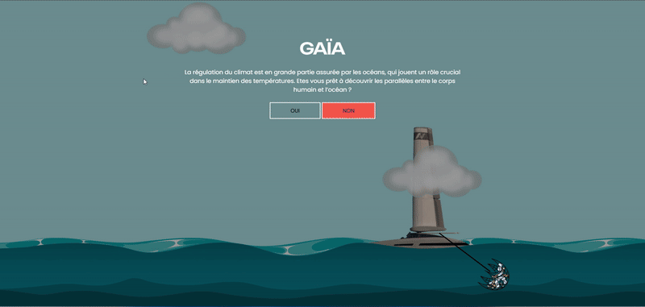

# 🌙 Nuit de l'Info 2024 – Développement d'un site en une nuit

## 🕐 Contexte
Projet réalisé lors de la **Nuit de l'Info 2024**, un hackathon national où l'objectif est de concevoir, designer et développer un site web en une seule nuit (de 16h à 8h du matin).  
Notre équipe a relevé le défi dans une ambiance collaborative, créative et sous pression !

## 💡 Objectif du projet
Développer une application web répondant à une problématique imposée le jour-même (thème confidentiel jusqu'au lancement).  
Nous avons conçu un site autour de :  
> _🎯 **Écologie de l’eau** – sensibilisation à la protection des ressources en eau, à une consommation responsable et aux défis environnementaux liés à l’eau._

## 🔧 Stack technique
- **Frontend** : HTML, CSS, JavaScript  
- **Outils** : GitHub, Trello, Figma

## ✨ Fonctionnalités
- Page d’accueil dynamique avec [x ou y]  
- Système de [connexion / quiz / galerie / don, etc.]  
- Interface responsive  
- Bonus : [animation / interaction / API externe ?]

## 📸 Aperçu
  

## 👥 Équipe
- **Dhanoush Kessavane & Royston Gnanapragasam** – Dev backend  
- **DAO Viet Long** – UI/UX  
- **Tout le monde** – Frontend  

## 🏁 Bilan
- Projet terminé à temps ✅  
- Travail d’équipe sous pression 💪  
- Nouvelles compétences acquises 🚀

---
